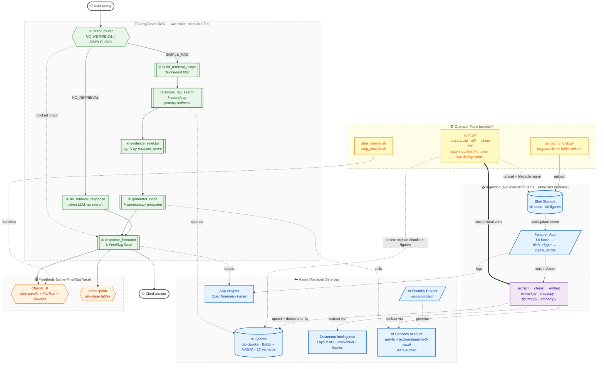

# Azure Observable RAG

[](https://youtu.be/n-VTv9xMGpw)

> 📺 **[Watch the demo walkthrough on YouTube](https://youtu.be/n-VTv9xMGpw)** — see the pipeline run end-to-end before reading further.

## Why "Observable RAG"

A traditional agentic RAG pipeline hides its work: the model decides what to retrieve, what to keep, and how to answer, all behind one chat-completions call. That makes the system fast to build but impossible to grade. This project takes the opposite stance:

- **Retrieval and generation are decoupled.** `search.py` knows nothing about LLMs. `generate.py` knows nothing about indexes. Each is testable in isolation.
- **Every node emits a typed trace.** `QueryPlanTrace`, `RetrievalTrace`, `EvidenceSelectionTrace`, `GenerationTrace`, all bundled into one `FinalRagTrace`. The trace shape is documented in [`src/tracing.py`](src/tracing.py).
- **No hidden chain-of-thought is exposed.** What the reviewer sees is the structured execution trace — intent, rewritten query, filters, retrieved chunks (with scores + semantic captions), selected evidence, model + token counts, final answer with `[chunk_id]` citations.

The reviewer can audit the full path of any query: which intent the router picked, what filter went to the search index, which chunks the index returned, which the selector kept, and exactly what the generator was given to answer.

## Architecture



The diagram uses **subgraphs as swimlanes** (one per concern: operator tooling, ingestion, Azure resources, LangGraph DAG, frontends) and **color-coded node classes** (Azure managed = blue, Python module = purple, LangGraph node = green, frontend = orange, operator script = yellow). Solid edges are runtime data flow; dotted edges are cross-lane references (search index lookups, model calls, telemetry); the bold `==>` edge is sync.py's local pipeline execution path. Renders directly in GitHub's Mermaid integration — no external diagramming tool.

**Two ingestion paths, one codebase.** Both `sync.py` (running in your local venv) and the deployed Function App's blob trigger import the SAME `src/extract.py`, `src/chunk.py`, `src/figures.py`, `src/embed.py`, and `src/ingest._delete_existing_chunks/_delete_existing_figures`. This means a fix in those modules takes effect everywhere after one Function App redeploy (`bash infra/deploy.sh`). `sync.py --full-rebuild` automatically stops the Function App for the duration of the rebuild so the local pipeline and the blob trigger never race against each other (`AZURE_FUNCTION_APP` + `AZURE_RESOURCE_GROUP` env vars in `.env`). For deletes, since blob triggers don't fire on delete events, `python scripts/sync.py` (default mode) is the canonical cleanup path — it removes orphan chunks AND their figure PNGs in `kb-figures/{stem}/`.

## Quickstart

### 1. Provision Azure resources (one-shot Bicep)

```bash
bash infra/deploy.sh kb-rag-rg swedencentral
```

This creates: Blob Storage + `kb-docs` container, Azure AI Search (Standard SKU — required for the semantic ranker), an **Azure AI Foundry** AI Services account with `text-embedding-3-small` + `gpt-4o` deployments and a Foundry Project (`kb-rag-project`), and Azure Document Intelligence (env-switchable OCR fallback). The script also auto-grants the deployer the three RBAC roles needed for AAD-authed access (Storage Blob Data Contributor, Azure AI Developer, Cognitive Services User) and writes `.env` at the repo root.

### 2. Install dependencies

The project is managed with **[uv](https://docs.astral.sh/uv/)** — a fast, deterministic Python package manager. `pyproject.toml` is the source of truth; `uv.lock` pins every transitive package for reproducibility.

```bash
# Install uv if you don't have it (one-time, ~10 MB)
brew install uv          # macOS
# or: curl -LsSf https://astral.sh/uv/install.sh | sh

# Create .venv and install everything (uses uv.lock — guaranteed reproducible)
uv sync --extra dev      # --extra dev adds pytest; drop it for runtime-only
```

The same `.venv` runs everything — dev work, the CLI, Chainlit, and the Jupyter walkthrough in [`notebooks/demo.ipynb`](notebooks/demo.ipynb). ~210 packages, ~480 MB on disk.

**Don't have uv?** A flat `requirements.txt` (auto-generated from `uv.lock`) is committed for compatibility:

```bash
python3.12 -m venv .venv && source .venv/bin/activate
pip install -r requirements.txt
```

> Note: `requirements.txt` is **auto-generated** — edit `pyproject.toml` instead, then run `uv lock && uv export --no-hashes --no-dev > requirements.txt` to regenerate.

### 3. Drop documents into `data/`

**Preferred — device-first layout (enables metadata-scoped retrieval):**

```
data/
  devices/
    {device_family}/             # e.g. network_access, payment_terminal,
      {model}/                   #      check_scanner, receipt_printer
        manuals/                 # PDF, MD — user manuals, installation guides
        troubleshooting/         # MD, TXT — error guides, recovery procedures
        policies/                # MD — manufacturer constraints, vendor policies
  shared/
    policies/                    # TXT — cross-device policies (data-retention, etc.)
    troubleshooting/             # MD — common network errors, shared guides
    manuals/                     # PDF, MD — cross-device manuals (currently empty)
```

The current corpus (see [data/document_manifest.csv](data/document_manifest.csv)) ships four devices: `network_access/meraki_mx67`, `payment_terminal/ingenico_desk5000`, `check_scanner/canon_cr120`, `receipt_printer/epson_tm_m30ii`. The orchestration layer extracts `scope` (`device`/`shared`), `device_family`, `device` (the model identifier), `doc_type`, `topic`, `version`, and `is_shared` from the path at ingest time. These fields drive device-first retrieval scoping without any LLM call.

### 4. Ingest (first-time setup)

```bash
python scripts/sync.py --full-rebuild
```

Wipes any existing `kb-chunks` index entries → uploads `data/` to blob → extracts via Azure Document Intelligence → chunks → embeds → upserts. **Stops the Function App during the run** so the local pipeline and the blob trigger never race. After this completes, day-to-day file changes are handled automatically by the Function App blob trigger (see [Scripts Reference](#scripts-reference)). Re-running is idempotent (chunk IDs are content hashes).

### 5. Run the demo — Jupyter notebook (primary) + Chainlit (alternative)

> 📺 Don't want to provision anything? **[Watch the recorded walkthrough on YouTube](https://youtu.be/n-VTv9xMGpw)** — same flow, no setup.

**▶ Recommended: Jupyter notebook walkthrough.** Open [`notebooks/demo.ipynb`](notebooks/demo.ipynb) and select the `.venv (3.12.2)` kernel. The notebook walks one PDF through **extract → chunk → embed → index → search → generate** with a structured table at every stage, so each pipeline step is independently inspectable. This is the canonical demo entry point — what you'd run to grade or evaluate the system end-to-end.

```bash
# from the repo root, with .venv set up (see step 2)
.venv/bin/jupyter notebook notebooks/demo.ipynb
# or open the file in VS Code / JupyterLab and pick kernel ".venv (3.12.2)"
```

**Alternative: Chainlit browser UI** (interactive chat, multi-turn memory):
```bash
./scripts/start_chainlit.sh    # background + auto-opens browser
# stop with: ./scripts/stop_chainlit.sh
```
FileTree mounted inline (cited files auto-attach to answers, opening in the right side panel for citation comparison); each LangGraph node renders as a step in the Chain-of-Thought drawer. Use this when you want to *interact* with the pipeline; use the notebook when you want to *inspect* it.

## Scripts Reference

All operational scripts live under `scripts/`. Each is a thin wrapper around the same `src/` modules used by the Function App, so behaviour is consistent across local runs and cloud-triggered ingests.

| Script | Purpose | When to use |
|---|---|---|
| `scripts/sync.py` | Reconcile **blob storage ↔ AI Search index** | All bulk operations + tear-down/rebuild |
| `scripts/upload_to_blob.py` | Push specific files/folders to blob | Targeted additions — Function App auto-ingests |
| `scripts/start_chainlit.sh` | Background-launch Chainlit on `:8000` | Open the web UI |
| `scripts/stop_chainlit.sh` | Kill whatever is on `:8000` | Free the port before relaunch |
| `scripts/dry_run_chunker.py` | Re-run `chunk.py` against cached DI output | Iterate on the chunker without paying for DI again |

### `scripts/sync.py` — the index/blob source-of-truth tool

Three modes; always shows what it will do before doing it.

```bash
python scripts/sync.py --show-diff      # preview only — no prompt, no changes
python scripts/sync.py                  # diff sync: prompts Y/n, then ingests new + deletes orphans
python scripts/sync.py --full-rebuild   # wipes index, re-uploads data/, re-ingests everything
```

| Mode | Use case |
|---|---|
| `--show-diff` | Quick check: "is the index in sync with blob right now?" |
| (default) | A blob was deleted manually or Function App missed an event → cleans up orphan chunks **and** their figure PNGs in `kb-figures/` |
| `--full-rebuild` | After `extract.py` / `chunk.py` schema changes, or to fix a contaminated index. Auto stop/starts the Function App via `AZURE_FUNCTION_APP` + `AZURE_RESOURCE_GROUP` env vars (set by `deploy.sh`) to eliminate the upload→trigger race |

**Note on deletes:** Azure Function blob triggers don't fire on blob delete — only add/update. So deletes always need `sync.py` (default mode) as the backstop. The diff also cleans up orphan PNGs under `kb-figures/{stem}/`.

### `scripts/upload_to_blob.py` — targeted upload, Function App handles the rest

```bash
python scripts/upload_to_blob.py "data/devices/receipt_printer/epson_tm_m30ii/manuals/tm-m30ii_trg_en_reva.pdf"  # one file
python scripts/upload_to_blob.py data/devices/receipt_printer/epson_tm_m30ii/                                    # one device folder
```

Uploads the path (file or directory, recursive) to the `kb-docs` container with `overwrite=True`. The Function App's blob trigger then runs the full extract → chunk → embed → upsert pipeline automatically, typically within 30–60 seconds. Use this for day-to-day additions without running any Python pipeline locally. **Path argument is required** — bulk uploads of the whole `data/` go through `sync.py --full-rebuild` instead (so the Function App can be safely paused).

### `scripts/start_chainlit.sh` / `scripts/stop_chainlit.sh` — UI lifecycle

```bash
./scripts/start_chainlit.sh                       # default port 8000, opens browser
CHAINLIT_PORT=9000 ./scripts/start_chainlit.sh    # custom port
./scripts/stop_chainlit.sh                        # kill whatever is on the port
```

Start runs Chainlit headless in the background (logs to `/tmp/chainlit.log`), waits for HTTP to respond, then opens the browser. Stop hard-kills any PID listening on the port — useful when "address already in use" errors block a relaunch.

## Repo Layout

```
infra/
  main.bicep         Storage + AI Search + AI Foundry (AI Services + Project) +
                     Doc Intelligence + Content Safety + App Insights + Function App
  deploy.sh          One-command provisioning + RBAC + Function App deploy + .env writer
  functions/         Function App package: blob-trigger auto-ingest
    function_app.py  blob_trigger("kb-docs/{name}") → src.ingest.ingest_single
    host.json
    requirements.txt

src/
  extract.py         Azure Document Intelligence Layout API → markdown + page metadata
                     + path → metadata parser (scope, device_family, device, doc_type, …)
  chunk.py           Markdown header splitter + token-bounded sub-splitter (structure-aware)
  figures.py         Crop figures from PDF using DI polygons → upload to kb-figures
  embed.py           Batched Azure OpenAI embeddings; AAD-first client factory
  index.py           Azure AI Search index schema (idempotent create-or-update)
  ingest.py          Pipeline orchestrator: blob → extract → chunk → embed → upsert
                     ingest_single() shared by sync.py and the Function App
  search.py          RETRIEVAL ONLY — RetrievalResult dataclass + hybrid_search()
  generate.py        GENERATION ONLY — grounded answer w/ [chunk_id] citations
  tracing.py         Typed trace objects + JSONL emitter
  agent.py           LangGraph StateGraph: 7 nodes, 3-branch conditional, multi-turn memory
                     Two routes: NO_RETRIEVAL (direct LLM) | SIMPLE_RAG (metadata-scoped hybrid search)
  app.py             Chainlit step-by-step UI + FileTree CustomElement + cited-source attach
  safety.py          Azure AI Content Safety pre/post filter
  telemetry.py       Application Insights / OpenTelemetry instrumentation

scripts/
  sync.py            Diff / full-rebuild reconciler (blob ↔ AI Search index)
  upload_to_blob.py  Targeted upload — Function App auto-ingests
  start_chainlit.sh  Background-launch Chainlit + open browser
  stop_chainlit.sh   Free the Chainlit port
  dry_run_chunker.py Re-run chunk.py against cached DI output (no DI cost)

notebooks/
  demo.ipynb         Walks one PDF through extract → chunk → index → search

tests/               Pytest suite (chunk, extract, search)
pytest.ini

data/                Sample corpus (committed) — see data/README.md for the layout contract
  document_manifest.csv  Path-to-metadata source-of-truth
  devices/{device_family}/{model}/{manuals|troubleshooting|policies}/
  shared/{manuals|troubleshooting|policies}/

public/
  elements/FileTree.jsx       Chainlit CustomElement rendering the corpus tree
  header_files_button.js      Header trigger to mount the FileTree

.chainlit/           Chainlit project config + translations
.env.example         Every config knob the pipeline reads
chainlit.md          Chainlit welcome message
requirements.txt
README.md            (this file)
```

## Orchestration Design

### Brief Coverage

The take-home brief asks for six pipeline stages and three deliverables. Mapping to this repo:

| # | Brief requirement | Where it lives | Notes |
|---|---|---|---|
| 1 | Extract text + metadata from documents | [`src/extract.py`](src/extract.py) | DI Layout API for PDFs (scanned + digital), native pass-through for `.md` / `.txt` / `.html`. The same module derives `scope`, `device_family`, `device`, `doc_type`, `topic`, `version`, `is_shared` from the blob path. |
| 2 | Chunk into retrieval-friendly segments | [`src/chunk.py`](src/chunk.py) | Markdown-header splitter + token-bounded sub-splitter; preserves heading path, page numbers, and table/figure refs. |
| 3 | Generate embeddings for each chunk | [`src/embed.py`](src/embed.py) | Batched `text-embedding-3-small` (1536 dim) via Azure OpenAI; AAD-first with API-key fallback. |
| 4 | Index the chunks | [`src/index.py`](src/index.py) + [`src/ingest.py`](src/ingest.py) | Idempotent `kb-chunks` schema (BM25 + HNSW vector + L2 semantic config); ingest orchestrator handles upload → extract → chunk → embed → upsert. |
| 5 | Hybrid search (keyword + vector + semantic) | [`src/search.py`](src/search.py) | `hybrid_search()` supports `bm25`, `vector`, `hybrid`, and `hybrid_semantic` (default). |
| 6 | Return top-N with metadata + semantic captions | `RetrievalResult` in [`src/search.py`](src/search.py) | Each result carries `score`, `reranker_score`, `semantic_caption`, the full metadata block, and a content preview. |
| D1 | `/src` folder with the six modules | [src/](src/) | All six present. Additional modules (`agent.py`, `app.py`, `figures.py`, `generate.py`, `safety.py`, `telemetry.py`, `tracing.py`) extend the pipeline into a small orchestrated agent on top of the brief. |
| D2 | `/notebooks` folder with a Jupyter walk-through | [notebooks/demo.ipynb](notebooks/demo.ipynb) | Runs one PDF through extract → chunk → index → search with per-stage tables. |
| D3 | `/docs` folder with README (setup, architecture, assumptions, limitations) | This file | README lives at the repo root rather than `/docs`; covers [Quickstart](#quickstart), the [architecture diagram](#architecture), [Assumptions](#assumptions), and [Known Limitations](#known-limitations). |

The remaining subsections below describe the orchestration we built **on top of** the brief — a small LangGraph DAG that turns the search results into a cited, audited answer.

### Two-Route Model

> 💡 **Innovation — cheap-path bypass for queries that don't need retrieval.**
> A pre-search router classifies system-capability and conceptual questions onto a `NO_RETRIEVAL` branch — 1 LLM call, 0 search calls, ~1 s end-to-end — instead of the default "always retrieve" pattern that pays embedding + search + generation cost on every turn. The same router doubles as the input safety gate, so unsafe prompts never reach the LLM.

| Route | When used | LLM calls | Search calls |
|---|---|---|---|
| **NO_RETRIEVAL** | System capability, usage, and general concept questions | 1 (direct answer) | 0 |
| **SIMPLE_RAG** | Any question requiring the knowledge base | 2 (router + generator) | 1–3 |

### File Path → Metadata

> 💡 **Innovation — folder structure as the metadata source-of-truth.**
> `scope`, `device_family`, `device`, `doc_type`, `topic`, `version`, and `is_shared` are derived deterministically from the blob path at ingest time — zero LLM extraction calls, fully reproducible, and any corpus reorganisation becomes a code-reviewable diff instead of an opaque model judgement. The contract is enforced by [data/document_manifest.csv](data/document_manifest.csv).

Every blob path is parsed deterministically at ingest time — no LLM call required.

```
devices/network_access/meraki_mx67/troubleshooting/wan_setup_and_led_reference.md
  → scope=device  device_family=network_access  device=meraki_mx67
    doc_type=troubleshooting  topic=wan-setup-and-led-reference

devices/check_scanner/canon_cr120/manuals/CR-150_CR-120_User_Manual_EN.pdf
  → scope=device  device_family=check_scanner  device=canon_cr120
    doc_type=manual  topic=cr-150-cr-120-user-manual-en

shared/policies/data_retention.txt
  → scope=shared  is_shared=True  doc_type=policy  topic=data-retention
```

These fields are stored as filterable fields in Azure AI Search and are available to the orchestration layer without any additional LLM calls.

### Device-First Retrieval

> 💡 **Innovation — 8-tier filter ladder with deterministic shared-doc and unfiltered fallbacks.**
> Most hybrid-search demos send the same filterless query for every question and let semantic ranking sort it out. We narrow as far as the router's evidence allows (device_family + device + doc_type), then broaden in two safe steps if results are thin, so legacy or cross-device documents are never silently excluded — and the entire policy is captured in OData filter dicts that the trace records verbatim.

The `build_retrieval_scope` node converts router output into OData filter dicts using this priority (narrowest → broadest). When `allow_shared_fallback=True` and a device-scoped primary filter was applied, a fallback filter against `shared/` of the same `doc_type` is also prepared:

```
1. device_family + device + doc_type → scope='device' AND device_family=F AND device=D AND doc_type=T
2. device_family + device            → scope='device' AND device_family=F AND device=D
3. device_family only                → scope='device' AND device_family=F
4. device + doc_type (no family)     → scope='device' AND device=D AND doc_type=T
5. device only (no family)           → scope='device' AND device=D
6. doc_type only (policy)            → scope='shared' AND doc_type='policy'
7. doc_type only (other)             → doc_type=T  (any scope)
8. no signal                         → no filter (full corpus search)
```

### LangGraph Graph

> 💡 **Innovation — the DAG itself is the audit surface.**
> Every node emits a typed trace (`QueryPlanTrace`, `RetrievalTrace`, `EvidenceSelectionTrace`, `GenerationTrace`), and the same `FinalRagTrace` payload drives the Chainlit step UI, the JSONL audit log, and any downstream eval. Compared to agent frameworks where the reasoning loop runs server-side (Foundry Agent Service, opaque ReAct loops), the reviewer here can replay any query end-to-end: which intent the router picked, what filter went to the index, which chunks came back, which the selector kept, exactly what the generator was given.

```
START
  → intent_router (safety gate + LLM route classification)
      ├─ blocked_input  ──────────────── response_formatter → END
      ├─ NO_RETRIEVAL → no_retrieval_response → response_formatter → END
      └─ SIMPLE_RAG
            → build_retrieval_scope   (deterministic, no LLM)
            → simple_rag_search       (primary + fallback, no LLM)
            → evidence_selector       (top-N by reranker_score, no LLM)
            → generator_node          (grounded generation + safety gate)
            → response_formatter → END
```

Nodes that are not LLM calls (build_retrieval_scope, simple_rag_search, evidence_selector) are deterministic and fully reproducible given the same index state.

## Assumptions

- Documents are organized in one of three layouts, all supported simultaneously:
  (a) **device-first** — `devices/{device_family}/{model}/{doc_type}/` + `shared/{doc_type}/` (the canonical layout used by the shipped corpus);
  (b) **legacy two-level** — `devices/{device}/{doc_type}/` (no `device_family`); or
  (c) **legacy flat** — `manuals/`, `troubleshooting/`, `policies/` at the top level.
- Metadata fields (`scope`, `device_family`, `device`, `doc_type`, `topic`, `version`, `is_shared`) are derived deterministically from the blob path — no LLM extraction required. `device` is taken directly from the path segment (the model identifier in the canonical layout, e.g. `meraki_mx67`).
- Embedding model is `text-embedding-3-small` (1536 dim). Swapping to `text-embedding-3-large` requires updating `EMBED_DIM` in `src/embed.py` and re-indexing.
- The `intent_router` classifies queries into `NO_RETRIEVAL` or `SIMPLE_RAG`. The `query_type` sub-classification (`troubleshoot`, `manual_lookup`, `policy_check`, `general_kb`, `conceptual`) informs downstream filter construction.
- All resources live in one resource group, one region.

## Known Limitations

- **Reproduction requires an active Azure subscription.** This project is Azure-native end-to-end (AI Search, AI Foundry, Document Intelligence, Content Safety, Application Insights, Function App). A fresh clone needs a working subscription with sufficient quota in the target region; the demo was built on an Azure **trial subscription**, which dictated the regional pin (`swedencentral`) and the use of Standard-tier AI Search (the trial blocked some larger SKUs / regions during the build).
- **No LangGraph checkpointer is configured.** Conversation history lives in `MemorySaver` (in-process); restarting Chainlit / the CLI clears every prior turn. A production deployment should wire `langgraph.checkpoint.sqlite.SqliteSaver` or the Postgres equivalent so threads persist across restarts.
- **Deletes are not auto-detected by the Function App.** Azure blob triggers fire only on add/update, not delete. After removing a blob, run `python scripts/sync.py` to clean up orphan chunks **and** their PNGs under `kb-figures/{stem}/`. Documented in [Scripts Reference](#scripts-reference).
- **Figure crops live in a public-blob container.** `kb-figures` is `publicAccess: 'Blob'` so Chainlit can render `cl.Image(url=...)` directly. Acceptable for this demo because the figures came from docs we shipped; a production deployment should switch to SAS-signed URLs.
- **No automated evaluation harness.** This iteration focuses on architecture and observability — there's no recall@k / groundedness / citation-correctness scoring. A gold-QA set + harness would be the next addition before claiming retrieval quality numbers.
- **No chunk-size or overlap sweep.** `CHUNK_MAX_TOKENS=512` and `CHUNK_OVERLAP_TOKENS=50` are common defaults but weren't tuned against this corpus. A production iteration would sweep e.g. `{256, 512, 1024}` × `{0, 10%, 20%}` overlap and measure recall@k / citation accuracy / context utilization on a held-out gold-QA set. Both values are env-overridable today (`src/chunk.py:218-219`), so the experiment infra is in place — only the eval harness is missing (see above).
- **Stage-1 candidate count tuned for demo clarity, not retrieval coverage.** Currently `RETRIEVAL_TOP_K=5` (Azure returns 5 reranked candidates) and `EVIDENCE_TOP_N=4` (evidence_selector keeps 4 for the LLM). Azure's L2 cross-encoder reranker can score up to **50 candidates per query** — Stage-1 should be widened toward that cap so the reranker has real headroom to surface the right document, while the LLM-context bound stays small. A reasonable production setting: `RETRIEVAL_TOP_K=50`, `EVIDENCE_TOP_N=5–8`. Rationale: the reranker is the highest-quality scoring stage; if BM25 / HNSW miss the right doc in their top 5, the reranker can't recover it — giving it 50 lets it actually do its job. Both values are env-overridable today (`src/agent.py:448, 513`).
- **No cost monitoring or budget guardrails.** Subscription-level budget alerts and per-resource quota caps aren't wired up. AI Search Standard bills hourly while the resource group exists; a long-running deploy can rack up spend without surfacing in the app. Add an Azure budget + alert before leaving the resource group running unattended.

## Cost Posture

**Verified during this build** (single resource group, swedencentral, ~6 hours active):

| Component | Spend pattern | Approx run cost |
|---|---|---|
| Azure AI Search Standard | Flat hourly: ~$0.30/hr (~$8/day, ~$250/mo) | $2 USD if you run it for one workday |
| `gpt-4o` calls (intent router + generator) | Pay per token. Demo query ≈ 758 in + 174 out tokens ≈ $0.007 | ~$0.10 for ~15 demo queries |
| `text-embedding-3-small` calls | Pay per token. ~$0.0002 ingest for the full corpus; ~$0.0001 per query | Pennies for the entire run |
| Storage account + blob | Negligible at the current ~25-file corpus | <$0.01 |
| Document Intelligence | $1.50 / 1000 pages on the prebuilt-layout model; cached results re-used by `dry_run_chunker.py` | <$0.10 for the shipped four PDFs |
| Azure AI Content Safety | $0.75 / 1000 text records (input + output check per query) | Cents for the entire run |
| Function App (Y1 Consumption) | Pay-per-execution; idle = $0 | <$0.01 — only fires on blob writes |
| Application Insights + Log Analytics | First 5 GB/month free, then ~$2.30/GB | Free tier covers the demo |

## Reproducibility Checklist

| Step | Command | Verifies |
|---|---|---|
| Provision | `bash infra/deploy.sh kb-rag-rg swedencentral` | `.env` exists; `az resource list -g kb-rag-rg` shows live resources (storage, search, ai-services + foundry-project, doc-intel, content-safety, log-analytics, app-insights, function-app + plan) |
| Install | `pip install -r requirements.txt` | clean dep tree |
| Ingest (first time / rebuild) | `python scripts/sync.py --full-rebuild` | `kb-chunks` index has N>0 docs; categories are `manual` / `troubleshooting` / `policy` (no `other`); `device_family` populated for all device docs |
| Add one file (Function App auto-ingest) | `python scripts/upload_to_blob.py "data/devices/.../new.pdf"` | New chunks appear within ~30–60 s with correct `device_family` + `device` + `doc_type` |
| Verify in-sync | `python scripts/sync.py --show-diff` | Reports `Already in sync — nothing to do.` |
| Delete one file (cleanup orphans) | `az storage blob delete …` then `python scripts/sync.py` | Removes both the chunks **and** the PNGs under `kb-figures/{stem}/` |
| Web UI | `./scripts/start_chainlit.sh` | FileTree mounts inline; 6 step panels appear in CoT; cited sources auto-attach to answers. Stop with `./scripts/stop_chainlit.sh` |
| Notebook walk-through | open `notebooks/demo.ipynb` and Run All | extract → chunk → index → search render w/ per-stage tables |
