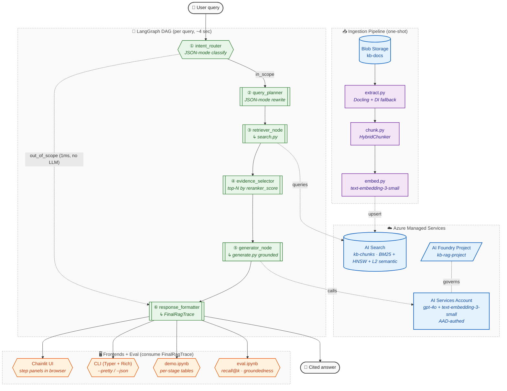

# Azure Observable RAG

> **Status: verified end-to-end.** Provisioned in `swedencentral`, ingested 9 sample docs (2 PDF / 3 MD / 4 TXT) into 26 chunks, demonstrated all four frontends (Chainlit / `cli chat` REPL / `cli ask` one-shot / notebook). Full LangGraph query (intent → plan → retrieve → select → generate → cite) returns a grounded answer in **~4 sec** with live token streaming. Out-of-scope queries short-circuit in **~1 ms** with no LLM cost. Multi-turn follow-ups in `cli chat` work end-to-end — *"what about Device B?"* gets correctly rewritten to *"How to factory reset Device Beta?"* by the planner using prior-turn context. Total Azure spend during build + demo: **well under $1 USD** of trial credit.

A retrieval-augmented search system over a mixed-format Azure Blob knowledge base (PDF / Markdown / TXT), built as an explicit, auditable **LangGraph DAG** instead of a black-box chatbot. Every retrieval and generation decision is captured as a typed trace object that is rendered in three frontends (Chainlit step UI, Rich CLI, Jupyter notebook) and consumed by an evaluation harness — *the same payload, three views*.

## Why "Observable RAG"

A traditional agentic RAG pipeline hides its work: the model decides what to retrieve, what to keep, and how to answer, all behind one chat-completions call. That makes the system fast to build but impossible to grade. This project takes the opposite stance:

- **Retrieval and generation are decoupled.** `search.py` knows nothing about LLMs. `generate.py` knows nothing about indexes. Each is testable in isolation.
- **Every node emits a typed trace.** `QueryPlanTrace`, `RetrievalTrace`, `EvidenceSelectionTrace`, `GenerationTrace`, all bundled into one `FinalRagTrace`. The trace shape is documented in [`src/tracing.py`](../src/tracing.py).
- **No hidden chain-of-thought is exposed.** What the reviewer sees is the structured execution trace — intent, rewritten query, filters, retrieved chunks (with scores + semantic captions), selected evidence, model + token counts, final answer with `[chunk_id]` citations.

The reviewer can audit the full path of any query: which intent the router picked, what filter went to the search index, which chunks the index returned, which the selector kept, and exactly what the generator was given to answer.

## Architecture



The diagram uses **subgraphs as swimlanes** (one per concern: ingestion, Azure resources, LangGraph DAG, frontends) and **color-coded node classes** (Azure managed = blue, Python module = purple, LangGraph node = green, frontend = orange). Solid edges are runtime data flow; dotted edges are cross-lane references (search index lookups, model calls). Renders directly in GitHub's Mermaid integration — no external diagramming tool.

## Quickstart

### 1. Provision Azure resources (one-shot Bicep)

```bash
bash infra/deploy.sh kb-rag-rg swedencentral
```

This creates: Blob Storage + `kb-docs` container, Azure AI Search (Standard SKU — required for the semantic ranker), an **Azure AI Foundry** AI Services account with `text-embedding-3-small` + `gpt-4o` deployments and a Foundry Project (`kb-rag-project`), and Azure Document Intelligence (env-switchable OCR fallback). The script also auto-grants the deployer the three RBAC roles needed for AAD-authed access (Storage Blob Data Contributor, Azure AI Developer, Cognitive Services User) and writes `.env` at the repo root.

**Region choice:** `swedencentral` is what we verified end-to-end. `eastus2` works in principle and gives access to `gpt-4.1-mini` (200 K TPM GlobalStandard) but had transient AI-Services capacity issues during our build. See [Provisioning notes](#provisioning-notes--gotchas) below for the per-region quota details.

### 2. Install dependencies

```bash
python -m venv .venv && source .venv/bin/activate
pip install -r requirements.txt
```

### 3. Drop documents into `data/`

```
data/
  manuals/          # PDF (digital or scanned)
  troubleshooting/  # Markdown
  policies/         # Plain text
```

The folder name becomes each chunk's `category` field, which the LangGraph `intent_router` uses to scope retrieval.

### 4. Ingest

```bash
python -m src.cli ingest
```

Walks `data/` → uploads to blob → extracts text via Docling → chunks with `HybridChunker` → embeds → upserts into the `kb-chunks` AI Search index. Re-running is idempotent (chunk IDs are content hashes).

### 5. Ask — four frontends

**`cli chat` — interactive REPL (Claude-Code-style):**
```bash
python -m src.cli chat
```
Persistent session with **multi-turn memory** (a follow-up like *"what about Device B?"* sees the prior turn's context), live token streaming, compact 1-line node status indicators, slash commands (`/help`, `/cost`, `/trace`, `/sources`, `/clear`, `/topk`, `/model`, `/save`, `/exit`), and a status footer showing model + cumulative tokens + USD spend. Up-arrow recalls previous queries from `~/.azure_rag_history`.

**Chainlit (browser, step-by-step UI):**
```bash
chainlit run src/app.py
```

**`cli ask` — one-shot CLI (Rich panels, screenshot- and SSH-friendly):**
```bash
python -m src.cli ask "How do I factory-reset Device A?"
python -m src.cli ask "..." --json | jq                  # raw FinalRagTrace JSON
python -m src.cli search "reset device A" --top-k 5      # retrieval ONLY, no LLM
```

**Notebook (per-stage tables):** open [`notebooks/demo.ipynb`](../notebooks/demo.ipynb).

### 6. Evaluate

Edit [`notebooks/gold_qa.json`](../notebooks/gold_qa.json) and fill in `gold_chunk_ids` for each question (use `python -m src.cli search "..." --json` to discover the right chunk IDs from your indexed corpus). Then:

```bash
python -m src.cli eval                    # scripted
# or open notebooks/eval.ipynb            # exploratory
```

Targets: `recall@5 ≥ 0.7`, `groundedness ≥ 4/5`, `citation_correctness = 1.0`.

## Repo Layout

```
infra/
  main.bicep         Storage + AI Search + Azure OpenAI + Doc Intelligence
  deploy.sh          One-command provisioning + .env writer

src/
  extract.py         Docling DocumentConverter (+ Azure DI fallback for scanned PDFs)
  chunk.py           Docling HybridChunker — structure-aware, token-bounded
  embed.py           Batched Azure OpenAI embeddings; shared client factory
  index.py           Azure AI Search index schema (idempotent create-or-update)
  ingest.py          Pipeline orchestrator: blob → extract → chunk → embed → upsert
  search.py          RETRIEVAL ONLY — RetrievalResult dataclass + hybrid_search()
  generate.py        GENERATION ONLY — grounded answer w/ [chunk_id] citations
  tracing.py         Typed trace objects + JSONL emitter
  agent.py           LangGraph StateGraph: 6 nodes + 1 conditional edge
  cli.py             Typer + Rich terminal frontend (ask / search / ingest / eval)
  app.py             Chainlit step-by-step UI
  eval_harness.py    Evaluation runner consumed by the CLI and the notebook

notebooks/
  demo.ipynb         Walks one query end-to-end with per-stage tables
  eval.ipynb         Per-question metrics + aggregate report
  gold_qa.json       Hand-curated Q&A set (fill in gold_chunk_ids before running eval)

docs/
  README.md          (this file)

data/                Mount point for sample documents (gitignored)

.env.example         Every config knob the pipeline reads
.chainlit/           Chainlit project config + welcome message
requirements.txt
```

## Design Trade-Offs

### Azure services chosen

| Service | Role | Why |
|---|---|---|
| **Blob Storage** | Source of truth for documents | Required by brief |
| **Azure AI Search (Standard)** | Hybrid retrieval (BM25 + HNSW vector + L2 semantic ranker + extractive captions) | The Azure differentiator. One service covers all three retrieval modes the brief calls for. Standard SKU is the lowest tier that supports the semantic ranker. |
| **Azure AI Foundry** (AI Services account `kind=AIServices` + Project sub-resource) | Unified model surface. `text-embedding-3-small` for ingest + `gpt-4o@2024-11-20` for router/planner/generator/judge. When `AZURE_AI_FOUNDRY_PROJECT_ENDPOINT` is set, [`src/embed.py`](../src/embed.py) authenticates via `DefaultAzureCredential` against the AI Services account's `cognitiveservices.azure.com` endpoint (the proven OpenAI route) — *not* through the project's discovery URL, which is for project management, not inference (see [Provisioning notes](#provisioning-notes--gotchas)). When the env var is unset, falls back to API-key AzureOpenAI. | Centralised RBAC and observability via the Foundry portal, no API keys in the request path. |
| **Docling (IBM, MIT)** | Default extractor + chunker | Unified parser for PDF (digital + scanned via built-in OCR), Markdown, HTML. `HybridChunker` produces structure-aware, token-bounded chunks with heading_path metadata. Collapses three extractor code paths into one. |
| **Azure Document Intelligence** | Optional fallback OCR for PDFs (`OCR_BACKEND=azure_di`) | Documented but off by default. Use it for handwriting, non-Latin scripts, or workloads requiring an Azure-managed OCR. |
| **Bicep** | IaC | Azure-native (CloudFormation/CDK analog). One-shot provisioning, ~80 LOC. |
| **LangGraph** | Agent orchestration | Explicit `StateGraph` is the audit surface (vs. Foundry Agent Service's server-side opaque loop). In-memory `MemorySaver` keeps thread-scoped conversation memory at zero infra cost. |
| **Chainlit** | Browser frontend | `cl.Step` per LangGraph node is the most natural way to render a trace live. |

### Azure services intentionally skipped

- **Azure AI Foundry Agent Service / Connected Agents** — strong "Azure cloud signal" but the agent loop runs server-side and isn't node-level inspectable. The brief here demands an *auditable* RAG path, so an explicit LangGraph DAG wins. (For production, the right move is often LangGraph as orchestrator + a Foundry agent as one node — best of both worlds.)
- **Azure Functions / Container Apps** — overkill for a 10-doc demo. The whole pipeline runs as `python -m …`.
- **Cosmos DB / Postgres** — `MemorySaver` is the in-memory checkpointer; production would swap in Cosmos.
- **Application Insights** — JSONL traces to `traces.jsonl` are sufficient for the demo; App Insights is a one-line swap on the emitter.

## Assumptions

- Documents land under exactly three folders: `manuals/`, `troubleshooting/`, `policies/`. Each becomes a `category` filter the router can use.
- Embedding model is `text-embedding-3-small` (1536 dim). Swapping to `text-embedding-3-large` requires updating `EMBED_DIM` in `src/embed.py` and re-indexing.
- The `intent_router` uses a fixed five-class taxonomy (manual_lookup / troubleshoot / policy_check / general_kb / out_of_scope). New corpora will need new intents.
- Authentication for Azure Blob and Azure AI Foundry uses `DefaultAzureCredential` (RBAC). `deploy.sh` auto-grants the deployer **Storage Blob Data Contributor** on the storage account, and **Azure AI Developer** + **Cognitive Services User** on the AI Services account (the latter is the data-plane role for chat/embedding calls via AAD). Allow ~1 minute for role propagation before the first ingest or query. Azure AI Search and Document Intelligence use API keys for simplicity.
- All resources live in one resource group, one region.

## Known Limitations

- **No re-indexing on doc deletion.** `ingest.py` upserts but never deletes. To remove a doc, `az search documents delete` against `kb-chunks` filtered by `doc_id`.
- **Token streaming in Chainlit is per-step, not per-token.** The generator's tokens are accumulated server-side and rendered when the node finishes. Adding per-token streaming would require bridging the synchronous `openai.stream` into Chainlit's async loop via a queue — left as future work.
- **`--filter` on the CLI `ask` command is informational only.** The `intent_router` decides filters; CLI overrides would need to inject into `RagState` before invocation.
- **Evidence selection is top-N by score.** No MMR, no LLM reranker. The dataclass + node split (`evidence_selector`) is structured to make adding either a one-file change.
- **LLM-as-judge for groundedness/relevance uses the same model that generated the answer.** For rigorous eval, swap to a stronger judge model.
- **Conversation memory** persists for a session via `MemorySaver` but is not durable; restarting the process clears it.

## Provisioning Notes / Gotchas

These are the seven distinct failure classes we hit during build. Documented here so the next deployer doesn't burn the same hours.

| # | Symptom | Root cause | Fix |
|---|---|---|---|
| 1 | `InsufficientQuota` for `gpt-4o-mini - GlobalStandard: 0/0` | Trial subs ship with 0 quota in most {model × SKU} cells | `az cognitiveservices usage list -l <region>` to find what *does* have quota; pick that |
| 2 | `ServiceModelDeprecated: gpt-4o-mini@2024-07-18 deprecated since 03/31/2026` | `gpt-4o-mini` is in deprecation freeze for *new* deployments (existing ones still serve) | Switch to `gpt-4o@2024-11-20` (current GA) or `gpt-4.1-mini@2025-04-14` |
| 3 | `NoRegisteredProviderFound for accounts/projects API version '2024-10-01'` | Bicep type cache lists the API but ARM doesn't accept it | Use `2026-03-01` (the lowest GA version that accepts the projects sub-resource) |
| 4 | `InsufficientResourcesAvailable: region 'eastus2' is currently out of resources for new services` | Region-level capacity constraint for new AI Services accounts (transient, varies by hour) | Pick another region with quota; we settled on `swedencentral` |
| 5 | `CustomDomainInUse: subdomain 'kb-aif-...' is not available` | Cognitive Services soft-deletes accounts and reserves the subdomain for 48 hr | `az cognitiveservices account list-deleted` then `az cognitiveservices account purge -g <rg> -n <name> -l <loc>` |
| 6 | `InvalidResourceProperties: SKU 'Standard' for text-embedding-3-small not supported in region` | SKU support varies per region per model. swedencentral wants `GlobalStandard` for embeddings, but `Standard` for chat — completely opposite to eastus2 conventions | `az cognitiveservices model list -l <region> --query "[?model.name=='<model>'] \| [0].model.skus"` |
| 7 | Bicep silently drops `allowProjectManagement: true` (warning BCP037 in build log) | Bicep's local type cache is months behind ARM. Properties not in the cache are *removed* during compilation | Use a recent API version on the parent resource (`Microsoft.CognitiveServices/accounts@2026-03-01`) so Bicep recognises the property |
| bonus | Bicep mangles output names: `AZURE_FOO` → `azurE_FOO` | Bicep camelCases identifiers; for ALL_CAPS prefixes it lowercases all but the last char of the prefix. The `.bicepparam` / `.bicep` source uses canonical names but the compiled JSON uses mangled ones | `deploy.sh` parses outputs case-insensitively (already handled) |
| bonus | `AIProjectClient.get_openai_client()` returns 404 on inference calls | The client constructs `<project>/openai/v1/embeddings` but Azure's actual inference path is `<account>.cognitiveservices.azure.com/openai/deployments/<name>/embeddings` — the project URL routes management traffic only | Use `AzureOpenAI(azure_endpoint=<account>.cognitiveservices.azure.com, azure_ad_token_provider=...)` directly. The Foundry project still owns RBAC and is portal-visible. (Confirmed pattern in [`src/embed.py`](../src/embed.py).) |

**Recommended one-time prep before first deploy** (saves ~10 min of failures):

```bash
# Register required RPs (new trial subs miss these)
az provider register --namespace Microsoft.Storage --wait
az provider register --namespace Microsoft.Search --wait

# Audit your actual quota in the target region — confirm a chat model has
# inference (non-FineTune) quota and confirm the embedding SKU you'll use
az cognitiveservices usage list -l swedencentral \
  --query "[?limit > \`0\` && contains(name.localizedValue, 'Tokens Per Minute')].{q:name.localizedValue, lim:limit}" \
  -o table | grep -vE 'FineTune|Batch|tts|audio|realtime|transcribe'
```

## Cost Posture

**Verified during this build** (single resource group, swedencentral, ~6 hours active):

| Component | Spend pattern | Approx run cost |
|---|---|---|
| Azure AI Search Standard | Flat hourly: ~$0.30/hr (~$8/day, ~$250/mo) | $2 USD if you run it for one workday |
| `gpt-4o` calls (intent + planner + generator + judge) | Pay per token. Demo query ≈ 758 in + 174 out tokens = ~$0.007 | ~$0.10 for ~15 demo queries |
| `text-embedding-3-small` calls | Pay per token. 26 chunks × ~400 tok = ~$0.0002 ingest; ~$0.0001 per query | Pennies for the entire run |
| Storage account + blob | Negligible at 9-doc volume | <$0.01 |
| Document Intelligence | Provisioned but unused (Docling did the OCR) | $0 |
| **Total observed during this build + demo** | | **< $1 USD** |

The dominant cost is **AI Search Standard at ~$0.30/hour, billed continuously**. To stop the meter:

```bash
az group delete -n kb-rag-rg --yes --no-wait
```

To then fully release the AI Services subdomain (otherwise it stays soft-deleted for 48 hr):

```bash
az cognitiveservices account purge -g kb-rag-rg -n <ai-services-name> -l swedencentral
az cognitiveservices account purge -g kb-rag-rg -n <doc-intel-name>   -l swedencentral
```

Cost-cutting alternatives (not used here):
- Drop AI Search to **Basic SKU** (~$75/mo) — loses the L2 semantic ranker but keeps BM25 + vector
- Use `gpt-4.1-mini` instead of `gpt-4o` (~10× cheaper per token) when a region has quota

## Reproducibility Checklist

| Step | Command | Verifies |
|---|---|---|
| Provision | `bash infra/deploy.sh kb-rag-rg swedencentral` | `.env` exists; `az resource list -g kb-rag-rg` shows 5 resources (storage, search, ai-services, doc-intel, foundry-project) |
| Install | `pip install -r requirements.txt` | clean dep tree |
| Ingest | `python -m src.cli ingest` | `kb-chunks` index has N>0 docs |
| Retrieval-only | `python -m src.cli search "..." --top-k 5` | `RetrievalResult` table renders |
| Full pipeline | `python -m src.cli ask "..."` | 6 Rich panels render in order |
| JSON trace | `python -m src.cli ask "..." --json \| jq` | machine-readable `FinalRagTrace` |
| Web UI | `chainlit run src/app.py` | 6 step panels appear in CoT, final answer with sources |
| Eval | `python -m src.cli eval` | metrics table; `eval_results.jsonl` written |
